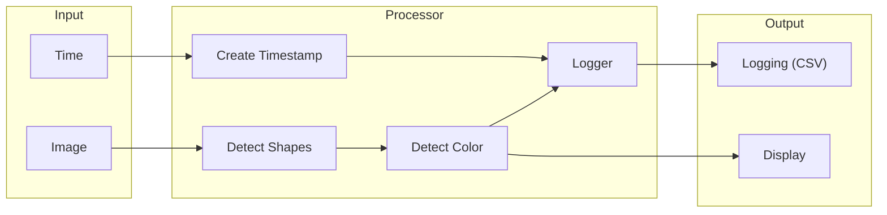

# BV3- FlowTrack
Optical Flow and Trajectory Estimator

Provide images and GPS coordinates and get a map.

## Requirements
- images
- parameters from camera calibration 


## Steps
- load images
- convert to gray scale (for processing)
- enhancing contrast by clahe algorithm
- 


## SW Tools

### Camera Calibration

Requirements:\
    - camera with manual mode for setting exposure time, focus distance and ISO (sensitivity) manually\
    - chessboard with 6x9 squares or similiar

This calibration calculates parameters for the correction of images.
The camera matrix contains the values for focal length and optical centers. The camera matrix parameter values (intrinsic) as well as the found distortion coefficients can be used for removing distortion which is caused by the camera lens.
Whereas the extrinsic parameters corresponds to rotation and translation vectors which translates the coordinates of a 3D point to a coordinate system.


Example parameters (which have to be saved in a file manually):
```
Camera matrix: 
1.75289881e+03 0.00000000e+00 5.48204571e+02
0.00000000e+00 1.75114882e+03 9.57329860e+02
0.00000000e+00 0.00000000e+00 1.00000000e+00

Distortion:
4.06432596e-02 -1.81478037e-01 -1.59435768e-03 1.78785960e-04 2.66227435e-01
```


### Frames Cutter
getFramesFromVideo.py

This program saves each frame from your provided video, allowing you to optimally set the parameters. This ensures that you get the optimum image section for processing by FlowTrack later.

**Description of adjustable parameters**
- videoFPS = input video fps
- fpsDivider = Depends from your desired fps rate for the extracted frames. \
  videoFPS / fpsDivider = output fps\
  30 fps / 5 = 6 fps
- resizedWidth and resizedHeight \
  It's important to provide a sufficient resolution. If the resolution is too low, FlowTrack may not find enough features, resulting in unsatisfactory tracking results.
- cropWidth, cropHeightBottom, cropHeightTop\
  Adjust the parameters if there are consistent elements in your image field, e.g. parts of your equipment (such as a car), or if a large part of the sky is visible.

Example:
```
videoFPS = 30 #input video fps
fpsDivider = 5 #fps divider

video_path = "C:/.../video"

resizedWidth = 1280
resizedHeight = 720

cropWidth = resizedWidth
cropHeightBottom = 200
cropHeightTop = 100
```

### GPX Plotter
gpxFilePlotter.py

This program visualizes your data from a GPX file. GPX files store GPS data as geographic latitude and longitude coordinates. To plot this data effectively, these coordinates are converted into UTM coordinates.


## Input-Processor-Output Diagram

